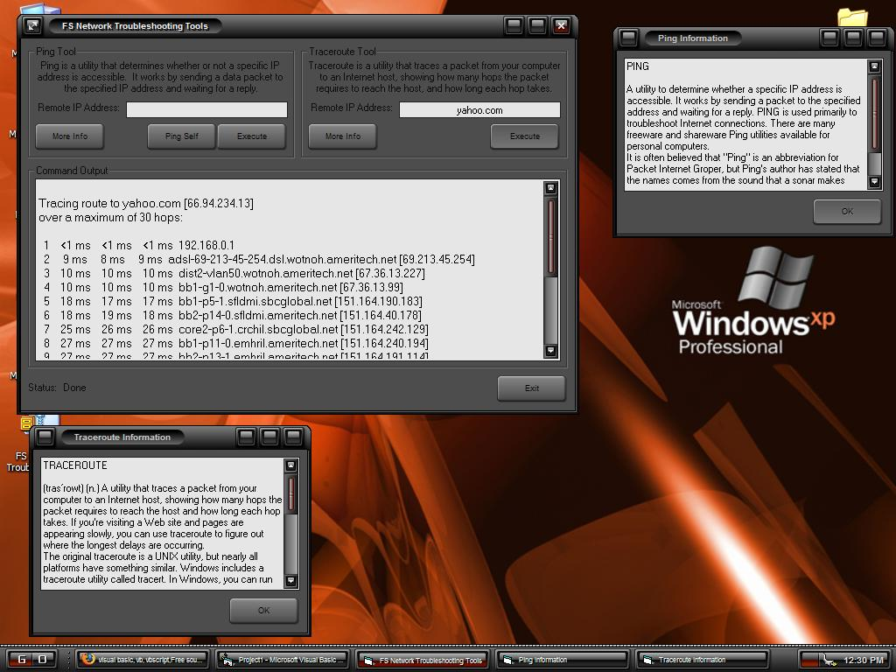



## Network Troubleshooting Tools

### Description

'I've been trying to get DOS command line output to show up in

'my Visual Basic programs. I finally figured it out. It works

'really simple. The program creates a batch file that is to be

'executed, instead of using the "Shell" command to execute single

'commands. The shell command also writes the output to a file.

'At the end of each batch file, the progams writes

'the word "DONE" to a text file called "finished." When a user

'starts a command, a timer constantly checks for the word "DONE"

'in the "finished" file. When the word finally is written to

'the file, the batch file is finished executing, and the program

'can read the output file it created.
 
### More Info
 

             |
---                |---
**Submitted On**   |2005-12-02 12:34:56
**By**             |[Frank Scarberry](https://github.com/Planet-Source-Code/PSCIndex/blob/master/ByAuthor/frank-scarberry.md)
**Level**          |Beginner
**User Rating**    |5.0 (15 globes from 3 users)
**Compatibility**  |VB 6\.0
**Category**       |[Internet/ HTML](https://github.com/Planet-Source-Code/PSCIndex/blob/master/ByCategory/internet-html__1-34.md)
**World**          |[Visual Basic](https://github.com/Planet-Source-Code/PSCIndex/blob/master/ByWorld/visual-basic.md)
**Archive File**   |[Network\_Tr1953111222005\.zip](https://github.com/Planet-Source-Code/frank-scarberry-network-troubleshooting-tools__1-63461/archive/master.zip)

